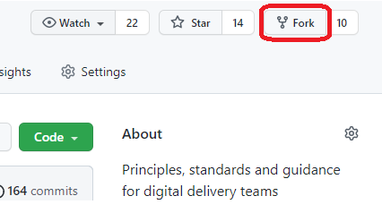
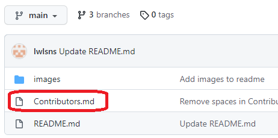
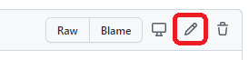

# First Contributions
A repository to help guide people through making their first contribution to a GitHub project

## Fork this repository

  

Fork this repository by clicking on the fork button on the top right of this page.
This will create a copy of this repository in your account.

  

## Make necessary changes and commit those changes

Now open `Contributors.md` by clicking on it in the file list, then click the edit button and add your name to it. Don't add it at the beginning or end of the file. Put it anywhere in between.

    

  

## Push changes to GitHub

## Submit your changes for review

If you go to your repository on GitHub, you'll see a `Compare & pull request` button. Click on that button.

Now submit the pull request.

## Where to go from here?

Congrats! You just completed the standard _fork -> clone -> edit -> pull request_ workflow that you'll encounter often as a contributor!
